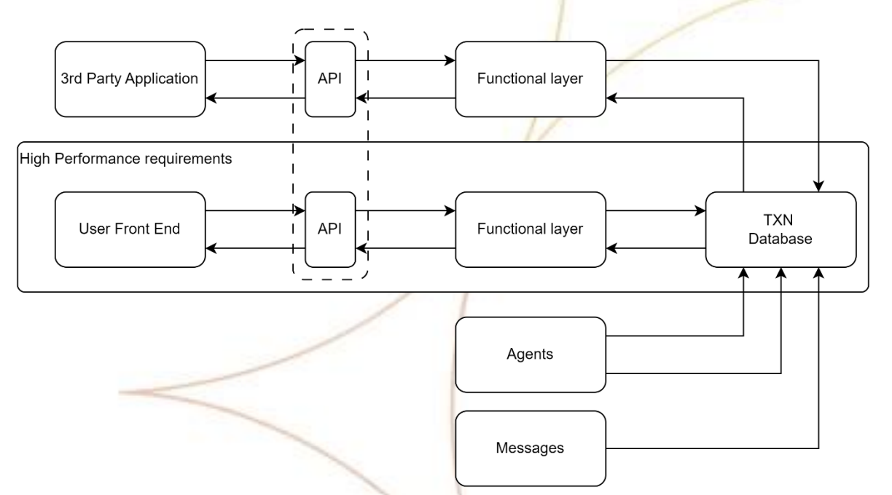

# Alchem Coding Challenge

## Task 
Below is a system diagram of a three-tier architecture with some additional components.
The system is performing badly and, as a company, we would like to have more visibility of
what is happening across the system. Each system component has information inside it that
we would like to collate and exploit for user analysis and diagnostics, leading to better
understanding of customer and system behaviour. 

### As a basic set of solution design principles
- You can not add any more load to the TXN database as it is operating at full capacity
- The third-party applications are currently synchronous, but unreliable
- The messaging infrastructure is available to you
- More APIs (public and private) can be made available
- Functional layers can be developed and deployed in the micro service architecture

### The Objective
1. [ ] Create a simple management console which can auto refresh the status of an object
in a database
2. [ ] Create an API (or openAPI specification) which can be polled by your management
console
3. [ ] A simple one table database (repository) to hold some event data
4. [X] A simple simulator that generates events to update your table
5. [ ] A simple test to prove that your solution works end to end

### Reminder

We are looking for a working solution prototype !! BUT !! Do not spend a long time on this!
If it’s more than a day it’s too long. We are after concepts that you can consider as building
blocks as part of your overall solution.
The key to this task is to identify your approach to the problems you are addressing. Then
describe what your solution(s) is doing to address the problem.
Consider your own ideas on how to prove it can be done, quickly and with compromise, if
necessary. 