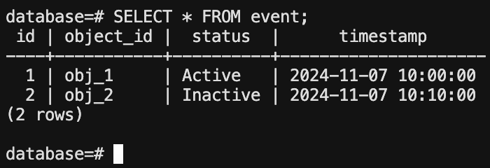

# My solution

- I have created the management console (ManagementConsoleComponent in Angular), which auto-refreshes the status of the object from the database every 10 seconds.
- The object status is fetched from the Flask API.

- The Flask app has an API endpoint (/status/{object_id}) that can be polled by the management console.
- I have set up Swagger UI to interact with and document your API, which would make it easier to test and view the API specification further down the line.

- I created a PostgreSQL database and a single table (Event) to hold the data, which includes object_id, status, and timestamp. This database is empty (to start, but there is a function to add some sample data), the intent would be to add entries via a web form. The web form would accept object_id and status, and then it would autofill the timestamp based on the time the user clicks submit.

- Added a function (create_sample_data) in the Flask app that populates the database with initial data (simulated events). These events are added before the first request.

## Issues I have faced:

- This is the first Angular project I have ever worked on, so there were a lot of learning curves. Typescript is also a completely new language to me. 

- I have downloaded version Angular 18.2.11, and I kept getting errors using HttpClientModule because it was deprecated. I made my way through Angular documentation but I got confused as to where it needed to be implemented based on if you were using standalone components or SSR. 

- Whilst I did implement the API calls, the HttpClientModule was not correctly set up in my standalone component, leading to errors in dependency injection. The SSR implementation was also adding extra complications to this because I don't think it works with standalone components.

